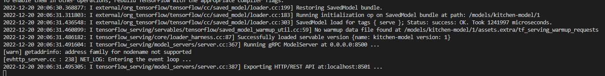
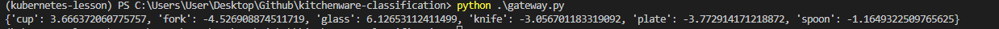
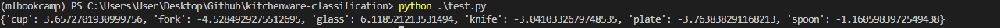
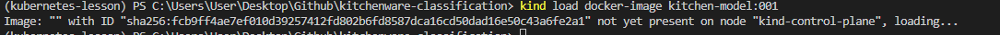
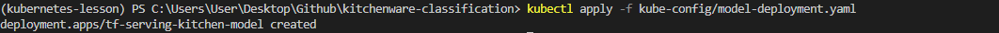

- [Kitchenware-Classification](#kitchenware-classification)
- [Enviroment](#enviroment)
  - [Create a conda enviroment](#create-a-conda-enviroment)
  - [Activate the enviroment](#activate-the-enviroment)
  - [Install ipykernel](#install-ipykernel)
  - [Install dependencies](#install-dependencies)
- [tf-serving-connect](#tf-serving-connect)
  - [Testing as a docker-container](#testing-as-a-docker-container)
- [Gateway](#gateway)
  - [Proto](#proto)
  - [Run the gateway (using an example)](#run-the-gateway-using-an-example)
  - [Run the gateway (using test.py)](#run-the-gateway-using-testpy)
- [Docker-compose](#docker-compose)
  - [Gateway Dockerfile](#gateway-dockerfile)
  - [Build Dockerfile](#build-dockerfile)
  - [Test it](#test-it)
  - [Model Dockerfile](#model-dockerfile)
  - [Build Dockerfile](#build-dockerfile-1)
  - [Docker-Compose code](#docker-compose-code)
  - [Build Docker-Compose](#build-docker-compose)
- [Kubernetes](#kubernetes)
  - [What's kubernetes?](#whats-kubernetes)
  - [Kind](#kind)
  - [kubectl](#kubectl)
    - [Install kubectl](#install-kubectl)
    - [Create a kind cluster](#create-a-kind-cluster)
  - [Deploying our model to K8s](#deploying-our-model-to-k8s)
    - [Make image visible to kind](#make-image-visible-to-kind)
    - [Deploy model](#deploy-model)
    - [Make sure that is running](#make-sure-that-is-running)

# Kitchenware-Classification
[DataTalks.Club](https://datatalks.club/) has organized an image classification competition.

In this competition you need to classify images of different kitchenware items into 6 classes:

- cups
- glasses
- plates
- spoons
- forks
- knives

The dataset is available [here](https://www.kaggle.com/competitions/kitchenware-classification/).
# Enviroment
I'll use a conda enviroment for this project.
## Create a conda enviroment
```bash
conda create -n mlbookcamp python=3.9.15
```
## Activate the enviroment
```bash
conda activate mlbookcamp
```
## Install ipykernel
```bash
conda install ipykernel
```
## Install dependencies
```bash
pip install -r requirements.txt
```
# tf-serving-connect
Working on [tf-serving-connect.ipynb](notebooks/tf-serving-connect.ipynb).


I'll try with an amazon picture. It looks like it's working because it is predicting well.
## Testing as a docker-container
```sh
    docker run -it --rm `
    -p 8500:8500 `
    -v "C:\Users\User\Desktop\Github\kitchenware-classification\kitchen-model:/models/kitchen-model/1" `
    -e MODEL_NAME=kitchen-model `
    tensorflow/serving:2.3.0
```

`Entering the event loop` means that is working well.
# Gateway
## Proto
Working on [proto.py](proto.py) because we're going use some functions from there.

The gateway will be serve on a Flask application. [Code](gateway.py)
## Run the gateway (using an example)
```sh
python gateway.py 
```
## Run the gateway (using [test.py](test.py))
```sh
python gateway.py
```



It's working as intended.

# Docker-compose
## Gateway Dockerfile
I'll create a dockerfile for the gateway
```docker
FROM python:3.9.15

RUN pip install pipenv

WORKDIR /app 

COPY ["Pipfile", "Pipfile.lock", "./"]

RUN pipenv install --system --deploy

COPY ["gateway.py", "proto.py", "./"]

EXPOSE 9696

ENTRYPOINT [ "gunicorn", "--bind=0.0.0.0:9696", "gateway:app" ]
```
## Build Dockerfile
```sh
docker build -t kitchen-gateway:001 -f image-gateway.Dockerfile .
```
## Test it
```sh
docker run -it --rm `
-p 9696:9696 `
kitchen-gateway:001
```
## Model Dockerfile
I'll create a model service.
```docker
FROM tensorflow/serving:2.7.0

COPY kitchen-model /models/kitchen-model 
ENV MODEL_NAME="kitchen-model"
```
## Build Dockerfile
```sh
docker build -t kitchen-model:001 -f image-model.Dockerfile .
```
## Docker-Compose code
```
version: "3.9"
services:
  kitchen-model:
    image: kitchen-model:001
  gateway:
    image: kitchen-gateway:001 
    environment:
      - TF_SERVING_HOST=kitchen-model:8500
    ports:
      - "9696:9696"
```
## Build Docker-Compose
```
docker-compose up
```



# Kubernetes
## What's kubernetes?
Kubernetes, also known as K8s, is an open-source system for automating deployment, scaling, and management of containerized applications.
## Kind
kind is a tool for running local Kubernetes clusters using Docker container “nodes”.
kind was primarily designed for testing Kubernetes itself, but may be used for local development or CI.

If you have already installed docker, you should have kind.
## kubectl
The Kubernetes command-line tool, kubectl, allows you to run commands against Kubernetes clusters. You can use kubectl to deploy applications, inspect and manage cluster resources, and view logs. For more information including a complete list of kubectl operations, see the kubectl reference documentation.
### Install kubectl
Follow this [link](https://kubernetes.io/docs/tasks/tools/) in order to install kubectl.
### Create a kind cluster
```sh
kind create cluster
```
## Deploying our model to K8s
Working on folder [kube-config](kube-config/). 

For the deployment part, I'll use [image-model.Dockerfile](image-model.Dockerfile), its name is kitchen-model:001.
### Make image visible to kind
```sh
kind load docker-image kitchen-model:001
```

### Deploy model
```sh
kubectl apply -f kube-config/model-deployment.yaml
```

### Make sure that is running
```sh
kubectl get pods
```
Its status has to be `RUNNING`
