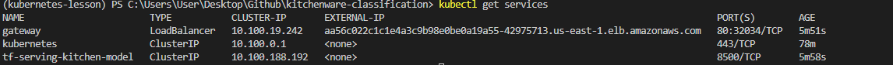
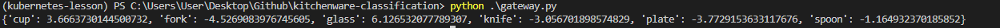

- [Kitchenware-Classification](#kitchenware-classification)
- [Tools](#tools)
- [Enviroment](#enviroment)
  - [Create a conda enviroment](#create-a-conda-enviroment)
  - [Activate the enviroment](#activate-the-enviroment)
  - [Install ipykernel](#install-ipykernel)
  - [Install dependencies](#install-dependencies)
- [tf-serving-connect](#tf-serving-connect)
  - [Testing as a docker-container](#testing-as-a-docker-container)
- [Gateway](#gateway)
  - [Proto](#proto)
  - [Run the gateway (using an example)](#run-the-gateway-using-an-example)
  - [Run the gateway (using test.py)](#run-the-gateway-using-testpy)
- [Docker-compose](#docker-compose)
  - [Gateway Dockerfile](#gateway-dockerfile)
  - [Build Dockerfile](#build-dockerfile)
  - [Test it](#test-it)
  - [Model Dockerfile](#model-dockerfile)
  - [Build Dockerfile](#build-dockerfile-1)
  - [Docker-Compose code](#docker-compose-code)
  - [Build Docker-Compose](#build-docker-compose)
- [Kubernetes](#kubernetes)
  - [What's kubernetes?](#whats-kubernetes)
  - [Kind](#kind)
  - [kubectl](#kubectl)
    - [Install kubectl](#install-kubectl)
    - [Create a kind cluster](#create-a-kind-cluster)
  - [Deploying our model to K8s](#deploying-our-model-to-k8s)
    - [Make image visible to kind](#make-image-visible-to-kind)
    - [Deploy model](#deploy-model)
    - [Make sure that is running](#make-sure-that-is-running)
    - [Test it](#test-it-1)
  - [Model Service](#model-service)
    - [Apply it](#apply-it)
    - [Make sure that was created using the following command](#make-sure-that-was-created-using-the-following-command)
    - [Test it](#test-it-2)
  - [Gateway deployment](#gateway-deployment)
    - [Making image visible to kind](#making-image-visible-to-kind)
    - [Apply it](#apply-it-1)
    - [Test it](#test-it-3)
  - [Gateway Service](#gateway-service)
    - [Apply it](#apply-it-2)
    - [Test it](#test-it-4)
- [Deploy it to EKS](#deploy-it-to-eks)
  - [Download EKSCTL](#download-eksctl)
  - [Create a cluster](#create-a-cluster)
  - [Public local images to ECR](#public-local-images-to-ecr)
    - [Create a repository](#create-a-repository)
  - [Push images to ECR](#push-images-to-ecr)
  - [Deploying our model to EKS](#deploying-our-model-to-eks)
  - [Apply deployments](#apply-deployments)
  - [Apply services](#apply-services)
  - [Get services in order to see if it working or not.](#get-services-in-order-to-see-if-it-working-or-not)
  - [Test it](#test-it-5)
  - [Change URL to test.py and test](#change-url-to-testpy-and-test)
  - [Delete cluster from cli](#delete-cluster-from-cli)
  - [Delete ECR images from cli](#delete-ecr-images-from-cli)

# Kitchenware-Classification
[DataTalks.Club](https://datatalks.club/) has organized an image classification competition.

In this competition you need to classify images of different kitchenware items into 6 classes:

- cups
- glasses
- plates
- spoons
- forks
- knives

The dataset is available [here](https://www.kaggle.com/competitions/kitchenware-classification/).
# Tools
- [Docker and Docker Compose](https://www.docker.com/)
- [Python](https://www.python.com)
- Pandas, Numpy, Matplotlib
- Tensorflow, Keras
- Flask
- Kubernetes/Kind/Kubectl
- [AWS EKS](https://docs.aws.amazon.com/eks/latest/userguide/getting-started-eksctl.html)

# Enviroment
I'll use a conda enviroment for this project.
## Create a conda enviroment
```bash
conda create -n mlbookcamp python=3.9.15
```
## Activate the enviroment
```bash
conda activate mlbookcamp
```
## Install ipykernel
```bash
conda install ipykernel
```
## Install dependencies
```bash
pip install -r requirements.txt
```
# tf-serving-connect
Working on [tf-serving-connect.ipynb](notebooks/tf-serving-connect.ipynb).


I'll try with an amazon picture. It looks like it's working because it is predicting well.
## Testing as a docker-container
```sh
    docker run -it --rm `
    -p 8500:8500 `
    -v "C:\Users\User\Desktop\Github\kitchenware-classification\kitchen-model:/models/kitchen-model/1" `
    -e MODEL_NAME=kitchen-model `
    tensorflow/serving:2.3.0
```

`Entering the event loop` means that is working well.
# Gateway
## Proto
Working on [proto.py](proto.py) because we're going use some functions from there.

The gateway will be serve on a [Flask application](gateway.py)
## Run the gateway (using an example)
```sh
python gateway.py 
```
## Run the gateway (using [test.py](test.py))
```sh
python gateway.py
```


It's working as intended.

# Docker-compose
## Gateway Dockerfile
I'll create a dockerfile for the gateway
```docker
FROM python:3.9.15

RUN pip install pipenv

WORKDIR /app 

COPY ["Pipfile", "Pipfile.lock", "./"]

RUN pipenv install --system --deploy

COPY ["gateway.py", "proto.py", "./"]

EXPOSE 9696

ENTRYPOINT [ "gunicorn", "--bind=0.0.0.0:9696", "gateway:app" ]
```
## Build Dockerfile
```sh
docker build -t kitchen-gateway:001 -f image-gateway.Dockerfile .
```
## Test it
```sh
docker run -it --rm `
-p 9696:9696 `
kitchen-gateway:001
```
## Model Dockerfile
I'll create a model service.
```docker
FROM tensorflow/serving:2.7.0

COPY kitchen-model /models/kitchen-model 
ENV MODEL_NAME="kitchen-model"
```
## Build Dockerfile
```sh
docker build -t kitchen-model:001 -f image-model.Dockerfile .
```
## Docker-Compose code
```
version: "3.9"
services:
  kitchen-model:
    image: kitchen-model:001
  gateway:
    image: kitchen-gateway:001 
    environment:
      - TF_SERVING_HOST=kitchen-model:8500
    ports:
      - "9696:9696"
```
## Build Docker-Compose
```
docker-compose up
```


# Kubernetes
## What's kubernetes?
Kubernetes, also known as K8s, is an open-source system for automating deployment, scaling, and management of containerized applications.
## Kind
kind is a tool for running local Kubernetes clusters using Docker container “nodes”.
kind was primarily designed for testing Kubernetes itself, but may be used for local development or CI.

If you have already installed docker, you should have kind.
## kubectl
The Kubernetes command-line tool, kubectl, allows you to run commands against Kubernetes clusters. You can use kubectl to deploy applications, inspect and manage cluster resources, and view logs. For more information including a complete list of kubectl operations, see the kubectl reference documentation.
### Install kubectl
Follow this [link](https://kubernetes.io/docs/tasks/tools/) in order to install kubectl.
### Create a kind cluster
```sh
kind create cluster
```
## Deploying our model to K8s
Working on folder [kube-config](kube-config/). 

For the deployment part, I'll use [image-model.Dockerfile](image-model.Dockerfile), its name is kitchen-model:001.
### Make image visible to kind
```sh
kind load docker-image kitchen-model:001
```

### Deploy model
```sh
kubectl apply -f kube-config/model-deployment.yaml
```

### Make sure that is running
```sh
kubectl get pods
```
Its status has to be `RUNNING`
### Test it
```sh
kubectl port-forward tf-serving-kitchen-model-796688984b-kcn9f 8500:8500
```
Use [gateway.py](gateway.py) for testing.


## Model Service
Working on [model-service.yaml](kube-config/model-service.yaml)
### Apply it
```sh
kubectl apply -f kube-config/model-service.yaml
```
### Make sure that was created using the following command
```sh
kubectl get services
```
### Test it
```sh
kubectl port-forward service/tf-serving-kitchen-model 8500:8500
```
Use [gateway.py](gateway.py) for testing.


## Gateway deployment
Working on [gateway-deployment.yaml](kube-config/gateway-deployment.yaml)
### Making image visible to kind
```sh
kind load docker-image kitchen-gateway:001
```
### Apply it
```sh
kubectl apply -f kube-config/gateway-deployment.yaml
```
### Test it
```sh
kubectl port-forward gateway-784f5cb9b6-sh8qb 9696:9696
```
Use [test.py](test.py) for testing.


## Gateway Service
Working on [gateway-service.yaml](kube-config/gateway-service.yaml)
### Apply it
```sh
kubectl apply -f kube-config/gateway-service.yaml
```
Make sure that is working well using `kubectl get services`

### Test it
```sh
kubectl port-forward service/gateway 8080:80
```
Use [test.py](test.py) for testing, but you have to change url.
Now should be `'http://localhost:8080/predict'`

# Deploy it to EKS
## Download [EKSCTL](https://docs.aws.amazon.com/eks/latest/userguide/eksctl.html)
## Create a cluster
Working on [eks-config](kube-config/eks-config.yaml)
```sh
eksctl create cluster -f kube-config/eks-config.yaml
```
Make sure that you have connected to AWS CLI before. Follow this [link](https://docs.aws.amazon.com/cli/latest/userguide/cli-configure-quickstart.html) for more details.
## Public local images to ECR
We have to publish `kitchen-gateway:001` and `kitchen-model:001`  in ECR

### Create a repository
```
aws ecr create-repository --repository-name kitchen-images
```
Obtain repositoryUri and get these data:

```sh
ACCOUNT_ID=546464646 
REGION=us-east-1 
REGISTRY_NAME=kitchen-images 
PREFIX=${ACCOUNT_ID}.dkr.ecr.${REGION}.amazonaws.com/${REGISTRY_NAME} 
```
Publish Gateway to ECR:

```sh
GATEWAY_LOCAL=kitchen-gateway:001 
GATEWAY_REMOTE=${PREFIX}:kitchen-gateway-001 
docker tag ${GATEWAY_LOCAL} ${GATEWAY_REMOTE}
```

Model:

```sh
MODEL_LOCAL=kitchen-model:001
MODEL_REMOTE=${PREFIX}:kitchen-model-001
docker tag ${MODEL_LOCAL} ${MODEL_REMOTE}
```

## Push images to ECR
First login to ECR
```sh
aws ecr get-login --no-include-email
```
Copy the output and paste it in your terminal.
```
$(aws ecr get-login --no-include-email) 
```
is a better option.

Push the images
```sh
docker push ${GATEWAY_REMOTE}
docker push ${MODEL_REMOTE}
```
## Deploying our model to EKS
Replace images names in [gateway-deployment.yaml](kube-config/gateway-deployment.yaml) and [model-deployment.yaml](kube-config/model-deployment.yaml)
with the uris of our ECR images.

Wait until the cluster has been created and then make sure that is working using `kubectl get nodes`. It has to show something like `ip-192-167-68-81.ec2.internal   Ready    <none>   57m   v1.23.13-eks-dff213`.

## Apply deployments
```sh
kubectl apply -f kube-config/model-deployment.yaml
kubectl apply -f kube-config/gateway-deployment.yaml
```
## Apply services
```sh
kubectl apply -f kube-config/model-service.yaml
kubectl apply -f kube-config/gateway-service.yaml
```
## Get services in order to see if it working or not.
```sh
kubectl get services
```

## Test it
```sh
kubectl port-forward service/tf-serving-kitchen-model 8500:8500
```
Use [gateway.py](gateway.py) for testing.



## Change URL to [test.py](test.py) and test 

```sh
kubectl port-forward service/gateway 8080:80
```
Use [test.py](test.py) for testing, but you have to change url.

Don't forget to delete all the services from AWS because they cost money.

## Delete cluster from cli
```
eksctl delete cluster --name kitchen-model-eks
```
## Delete ECR images from cli
```
aws ecr batch-delete-image --repository-name kitchen-images --image-ids imageTag=kitchen-gateway-001
aws ecr batch-delete-image --repository-name kitchen-images --image-ids imageTag=kitchen-model-001
```
